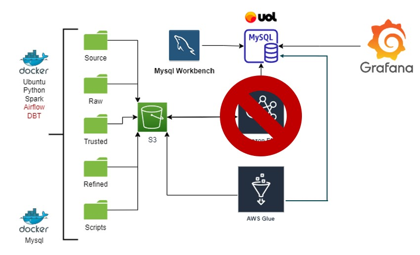
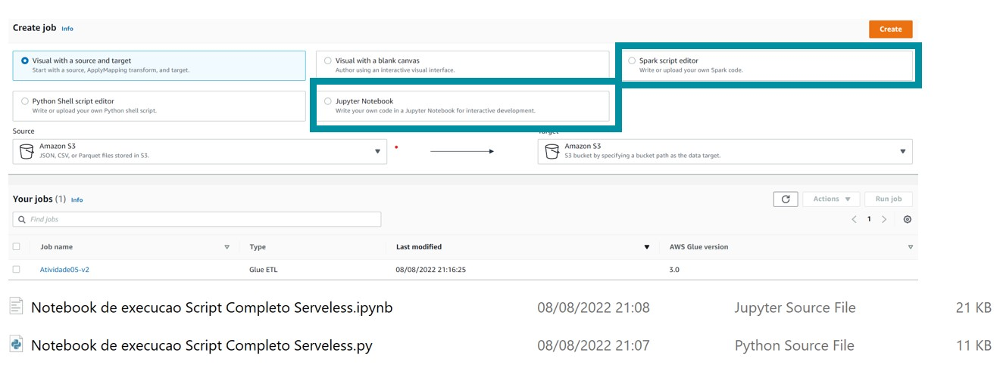
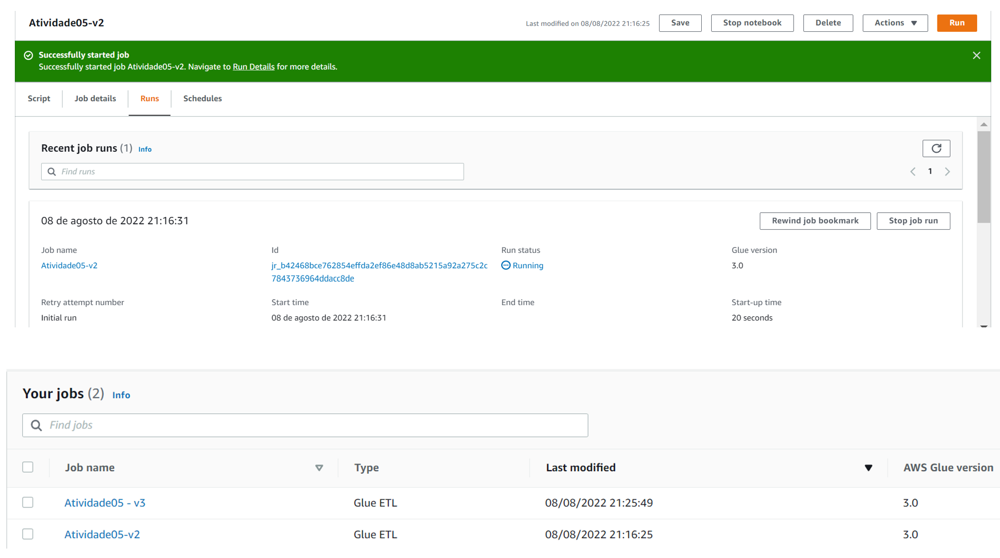
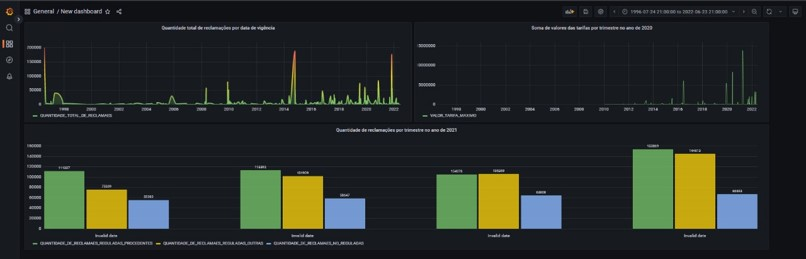

# trabalho05_eEDB_011

Tarefa 5 - Aula 6
Implementar  a atividades da tarefa 3  ou da tarefa 5 (escolher uma das duas tarefas) com as seguintes diferenças:

O processamento realizado deve ser aplicado em um serviço Serverless***

A fonte de dados dever ser as seguintes:

1 -  Ranking de Instituições por Índice de Reclamações (Arquivos CSV)

2 - Tarifas Bancárias - por Segmento e por Instituição (Dados em uma base de dados Relacional)

Camadas de Dados no AWS S3:

RAW (Dados Crus)
Trusted (Dados Tratados mas sem implementação de modelagem)
Analytics (Modelado em Star Schema - Replicados em base de dados relacional)
Camadas Trusted e Analytics devem ser mapeadas no AWS Glue Catalog

Implementar Airflow e DBT é opcional

## 🚀 Começando

Trabalho 05 ministrado pelo professor Leandro Mendes Ferreira no segundo semestre de 2022 - Ingestão de Dados.

Defininos as seguintes camadas: 

- `Raw`: Pasta para dados brutos
- `Raw_scripts`: Pasta de Códigos para dados brutos
- `Trusted`: Pasta para Dados tratados
- `Trusted_scripts`: Pasta de Códigos para Dados tratados
- `Refined`: Pasta para Dados Dados tratados e modelados
- `Refined_scripts`: Pasta de Códigos para Dados Dados tratados e modelados
- `source`: Dados para extração
- `drivers`: jar para execução de inserção Spark 

## 📋 Implementação

* 1 - Nossa estratégia foi recriar a estrutura de camadas exigidas para as atividades anteriores dentro do S3. Entendemos que o mais adequado seria criar um bucket para cada camada, mas como os código já haviam sido modificados para um único bucket, mantivemos essa estrutura. 

* 2 - Como dessa vez não poderíamos utilizar um cluster gerenciável, nossa primeira estratégia foi utilizar o AWS Glue para a execução dos scripts.
No Glue, poderíamos adotar uma estratégia de subir um script Python em notebook e executá-lo, ou submeter um script Spark. Criamos um Job para cada estratégia.

* 3 - Cada job criou os resultados no S3 e na base do Mysql.

* 4 - Também tentamos viabilizar a execução do Spark no Lambda. Porém, em virtude das limitações do Lambda (tamanho máximo de arquivo para submeter), não conseguimos rodar a função necessária. Nossa estratégia inicial de utilizar Pyspak se provou um dificultador para a realização das demais tarefas em comparação à um código implementado com Python puro.

 
* 5 - Base MySQL adquirido do provedor UOL. Reaproveitamos da atividade anterior

* 6 - Grafana para visualização dos dados
 
 
* 7 - MySQL Workbench para verificação do processo de inserção de dados na base uol.
  
 * 8 - AWS Glue para documentação do catálogo de dados.
 Para gerar a documentação do catálogo de dados seguimos o seguinte processo:
   Criar duas bases de dados, uma para cada repositório do S3 que queríamos documentar (trusted e refined)
   Configurar dois crawlers para mapear a estruturas dos dados de cada repositório.
   Iniciar os crawlers que geraram as respectivas tabelas de metadados de cada repositório

## Resultados
Acreditamos que atendemos todos os requisitos obrigatórios propostos para a tarefa. 
  Tivemos problemas para criar uma aplicação serveless para rodar Spark no Lambda, mas a execução no Glue ocorreu como esperado.

## 🛠️ Construído com
* [Python](https://www.python.org/) - Linhas de código utilizado para programação;
* [PySpark](https://spark.apache.org/docs/latest/api/python/) - Utilizado para ETL dos dados;
* [MySQL](https://www.mysql.com/) - Utilizado para ETL dos dados;
* [AWS S3](https://aws.amazon.com/pt/s3/) - Utilizado como repositório de dados;
* [AWS Glue](https://https://aws.amazon.com/pt/glue/?whats-new-cards.sort-by=item.additionalFields.postDateTime&whats-new-cards.sort-order=desc/) - Utilizado para mapeamento do catálogo de dados;

## ✒️ Autores
* [Rodrigo Vitorino](https://github.com/digaumlv)
* [Thais Nabe](https://github.com/thaisnabe)
* [Vitor Marques](https://github.com/vitormrqs)
* [Wesley Lourenço Barbosa](https://github.com/wesleyloubar)

